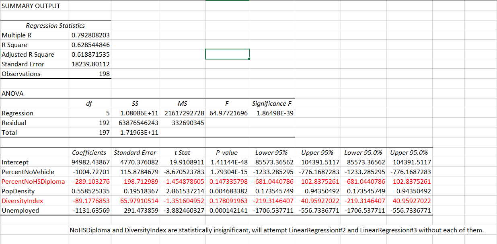
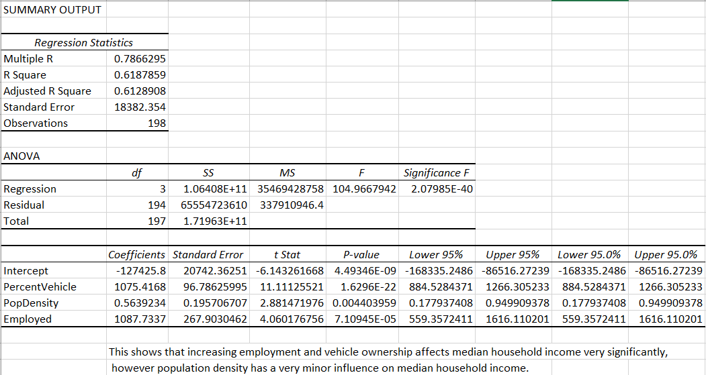
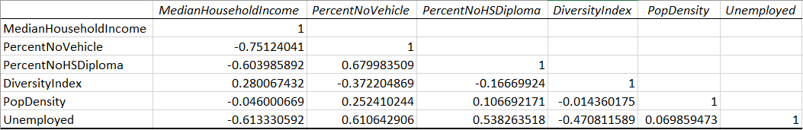
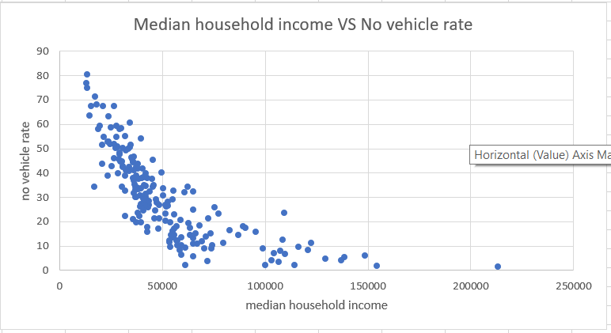
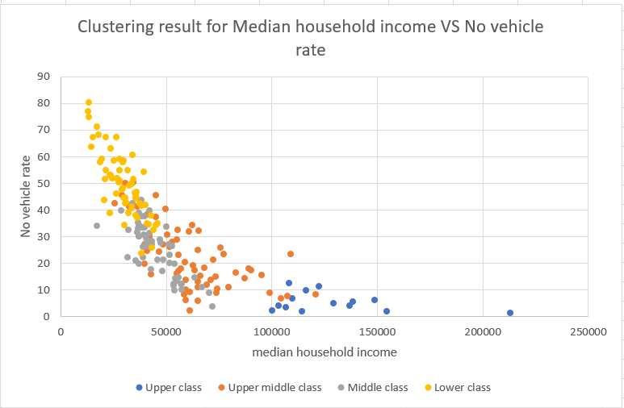
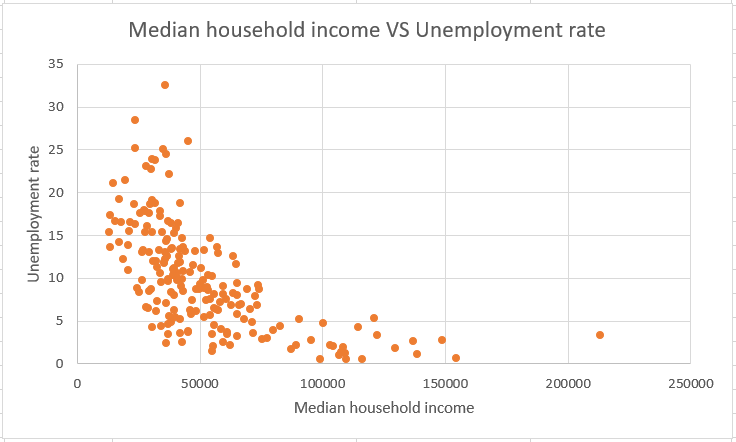
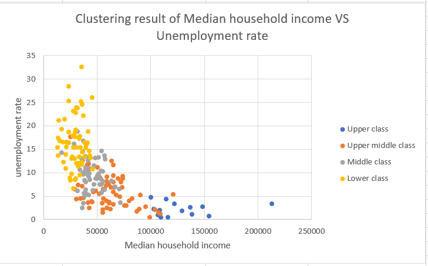
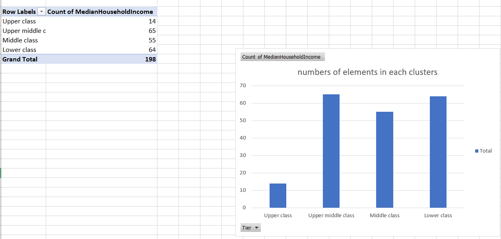

# Factors that affect the median household income in Baltimore city

# Summary 
There are many factors that can affect the median household income in Baltimore City: population density, employement rate, percentage of high-school degree, diversity and percentage of car ownership. The main business question of this project is to find which one or some of them may have the main influence on the overall outcome and give some advice to improve the household income based on the result; as in the case of Baltimore, the median household income is more than $10,000 below the national average. Realizing which factors affect the median household income could help with future policy changes in order to raise Baltimore's median closer to the national average.

# Challenge 

This problem is challenging because there are many different factors that can affect the median household income and it would be hard to distinguish one from another. In order to find them out, we need to use certain math skills to help us find the optimal solution. Another challenge is about the data collection process. The data documentation on the website is not super clear and we have to go through another database to find out the right specifications for the need of this project. 

# Solution

## Data Collection 
- Data sources
    - Main data source: [Maryland Food System Data, Johns Hopkins Center for a Livable Future](https://data-clf.hub.arcgis.com/)
    - Supporting data source: [Maryland census data](https://data.imap.maryland.gov/datasets/maryland-census-boundaries-census-tracts-2010)
    - `Maryland_Census_Data__Census_Tracts.xlsx` is Maryland census data we used to get the unique ID (CT2010) for later JOIN operation to filter the data
    - `Filtered 2010.xlsx` is the filtered CT2010 list 
- File specification 
    - Please check under the folder `Baltimore Data` under `data` folder 
    - `Baltimore_%_No_Vehicles_Available_20142018.xlsx` is the data for percentage of people who don't have vehicles from 2014 to 2018 
    - `Baltimore_%_of_Adults_with_No_High_School_Diploma_20142018.xlsx` is the data for the percentage of people who don't have a high school diploma
    - `Baltimore_2010_Population_Density.xlsx` is the data for population density of Baltimore city
    - `Baltimore_Diversity_Index_2018.xlsx` is the data for diversity in Baltimore 
    - `Baltimore_Median_Household_Income_20142018.xlsx` is the data for median household income from 2014 to 2018
    - `Baltimore_Unemployed.xlsx` is the data for the unemployement rate
    - `Baltimore_Master.xlsx` is the master dataset that we use for data analysis. It includes all the data above.
    - `PIVOTTable.xlsx` is the master dataset organized into a PIVOT table for ease of use.

## Data Analysis

Our solutions contain two parts: Linear regression and clustering. 

- Linear regression: 
    - In this section, we created logistic regressions using the data we found. Altogether, it took us six attempts to find the best linear regression; with the first testing all five variables, ultimately showing that DiversityIndex and PercentNoHSDiploma were not statistically significant. The next two trials were testing out if one was statistically significant without the other, which was to no avail. Trial four found that PercentNoVehicle, PopDensity, and Unemployed were statistically significant. However, the coefficient for PopDensity was nearly zero, so we attempted the linear regression without it. At this time, we also decided to convert PercentNoVehicle to PercentVehicle and Unemployed to Employed. Trial five found that the R Square value dropped, so PopDensity was added back in. Thus, the final linear regression included: PercentVehicle, Employed, and PopDensity. Additionally, we found the correlation between the variables.
    - Please check the `Regression Models Folder` for more details
    
- Clustering: 
    - In this section, we implemented the clustering algorithm based on z-values for all of those five factors. The way we select anchors is based on the median household income. We select four anchors according to the quartile: 25%, 50%, 75% and 100%. Then, we compared the z-values to those four anchors and assign the record to the minimum value from four results. Use Excel Solver to test the result and make sure that everything is correct. 
     - Please check the `Clustering.xlsx` for more details

## Data Visualization 
- Linear regression:
    - Image 1 - Linear Regression Model of DiversityIndex, PercentNoHSDiploma, PercentNoVehicle, PopDensity, & Unemployed's Influence on Median Household Income
    - 
    - Image 2 - Linear Regression Model of PercentVehicle, PopDensity, & Employed's Influence on Median Household Income
    - 
    - Image 3 - Correlation of Each Variable
    - 
- Clustering: 
    - The following graphs are the comparision between the no vehicle rate and median household income 
    - 
    - 
    - The following graphs are the comparison between unemployment rate and median household income 
    - 
    - 
    - The following graph shows how many elements are there in each cluster
    - 

## Data Interpretation 

- Regression: Ultimately, we found that the only variables that were statistically signifcant were Vehicle Ownership, Population Density, and Employment Status. Such that, Diversity and having a High School Diploma do not appear to have a statistically significant impact on Median Household Income. Amongst the three variables that do affect income, Population Density has very little impact on income. For every unit increase of Population Density, Median Household Income increases by 0.563923393. However, increasing the percentage of vehicle ownership by 1% increase income by $1075 and increasing the employment rate by 1% increases income $1088. Thus, owning a vehicle and employement rate have the largest impact on Median Household Income. Nevertheless, the correlation between variables shows that the employment rate and vehicle ownership are significantly correlated. It could be safe to assume that income and employment status may appear to have a bigger influence on vehicle ownership than vehicle ownership has on income. More research would be needed into this.

- Clustering: From the result of clustering, we figure out that there may be four clusters in the group or maybe less than four. As indicated in the vehicle rate, the upper class is really outstanding. However, for the upper middle and middle class, the boundary may not be that clear and there are lots of intersections between them. They may belong to the same cluster and more research needs to be done in this part. There is also a clear lower class cluster in the group, but the size of it may be less than the current one since after we readjust the center of our clustering method, it may change the representation as well. From the data we have, we can say that employeement rate is highly related to the median household income in this case. For car ownership percentage, it is more like an indicator for a household's income rather than a factor. 

# Future Suggestion 

- Improve the employment rate by implementing different projects could finally enhance the average household income in the city. As vehicle ownership is more likely to be influenced by employment and income, we would not recommend giving out cars to Baltimore City residents in hope of increasing the median houshold income. However, exploring new policies towards increasing the employment rate would significantly improve the median household income closer to the national average.

- Since population density would also contribute to the median household income, we also do more research in how to use resources in a more efficient way to improve the total profit we can get. As it appears now, population density appears to have a slight impact on median household income, but further research could improve results. More data related to this topic may help to find out the optimal solution to utilizing population density as a factor of improving median household income.

